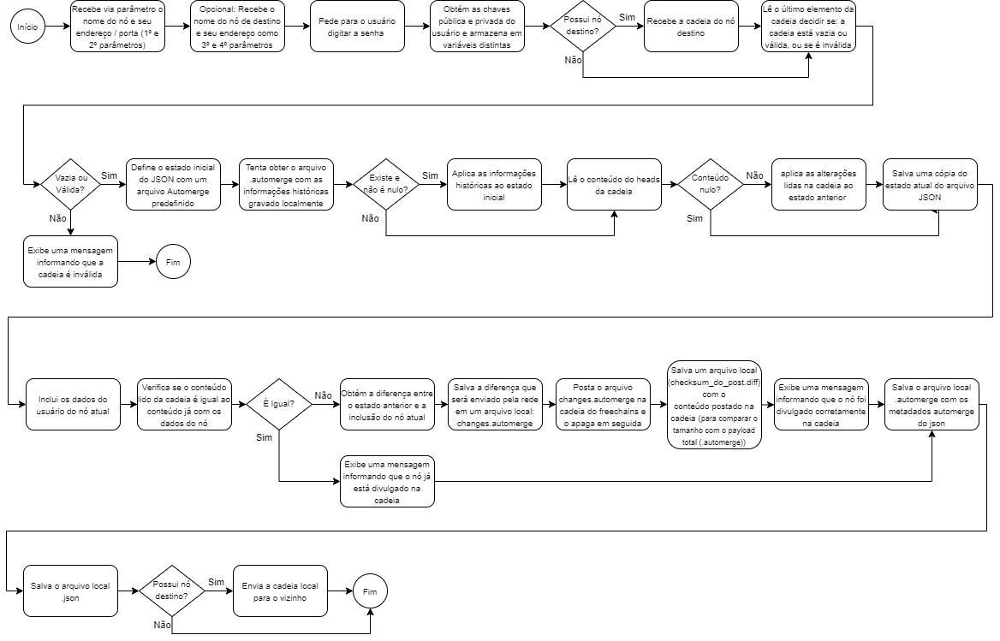

Freechains & Automerge - Experimentando um CmRDT JSON Based no Freechains
=========================================================================

O objetivo desse experimento é demonstrar a integração entre o
[Automerge](https://github.com/automerge/automerge) e o [Freechains
](https://github.com/Freechains/README)e obter ganho dessa coexistência.

O [Freechains](https://github.com/Freechains/README) é uma rede de disseminação
de conteúdo peer-to-peer, baseada nos modelos local-first baseado em tópicos
publish-subscribe. Utiliza o sistema de disseminação nõa estruturada baseada em
gossip, utiliza ordenação parcial de melhor esforço baseada em happened-before,
possui um sistema de reputação por tópico para garantir a qualidade e a saude da
rede e por fim permite diversos tipos de comunicação pública e privada (1-\> N,
1 \<-N, N \<-\> N, 1 \<-).

O [Automerge](https://github.com/automerge/automerge) funciona como um
commutative replicated data type, ou CmRDT, JSON based, ou seja, ele cria uma
estrutura de dados JSON armazenada em disco na forma de um arquivo de operações.

 

O que foi feito?
----------------

O objetivo do experimento é: Compartilhar através dessa cadeia dados dos usuarios 
dos nós, como nome, chave pública, endereço e porta e sincronizar entre os pares, 
com o objetivo de que todos os pares tenham um json local com a informação pública 
dos participantes de todos os nós que possuam a cadeia.

O experimento foi realizado sa seguinte forma:

-   Iniciei 3 nós do Freechains: Node 1, Node 2 e Node 3 e criei uma cadeia no 
    formato grupo privado chamada $crdt nos 3 nós.

-   Realizei os seguintes passos:
   
   1. Utilizei a ferramenta nodesync com sincronismo com os Nodes 1 e 2, e verifiquei
      os arquivos gerados no Node 1 e as postagens relizadas.
      
   2. Utilizei a ferramenta nodesync com sincronismo com os Nodes 2 e 3, e verifiquei
      os arquivos gerados no Node 2 e as postagens relizadas
      
   3. Utilizei a ferramenta nodesync sem sincronismo com o Nodes 3 e verifiquei os 
      arquivos gerados no Node 3.
   
   4. Utilizei a ferramenta nodesync com sincronismo com os Nodes 2 e 3, e verifiquei
      a atualização (com os dados do node 3) dos arquivos gerados no Node 2 e das 
      postagens realizadas. 

   5. Utilizei a ferramenta nodesync com sincronismo com os Nodes 1 e 2, e verifiquei
      a atualização dos arquivos (com os dados dos nodes 2 e 3) gerados no Node 1 
      e das postagens realizadas. 
      
   6. Nesse momento iniciei mais um nó do Freechains: Node 4 e dei um joint na cadeia
      $crdt neste nó.
   
   7. Utilizei a ferramenta nodesync com sincronismo com os Nodes 4 e 3, e verifiquei
      os arquivos gerados no Node 4 e as postagens relizadas
      
   8. Fui realizando nodesyncs com sincronismo entre os nós até que todos tivessem os 
      dados dos demais participantes da cadeia.
      
          
O que concluí?
---------------

Utilizando o automerge como CmRDT conseguimos economizar o trafego de dados na rede pois
podemos trafegar apenas as diferenças entre um nó e seu vizinho, apesar de isso exigir algumas
iterações para que todos possuam as informações de todos participantes. Um benefício adiciona de 
uso do automerge é que ele como um modelo CmRDT, possui o armazenamento do histórico de operações 
realizadas no arquivo desde a sua criação, todos os arquivos locais .automerge possuem esse 
histórico, mas o custo disso é o usuário ter que possuir dois arquivos locais, um json explicito 
e um json formatado como automerge. Um outro ponto notado é que o arquivo automerge é bem maior
que o arquivo json explicito, isso faz sentido devido ao armazenamento do histórico das operações.
O automerge permite algumas operações de undo e redo nessa forma que estamos usando, porque
em específico o recurso de desfazer desfaz a alteração mais recente do usuário local, mas
ele não pode ser usado atualmente para reverter as alterações feitas por outros usuários.

Desenvolvimento
---------------

Desenvolvi um aplicativo utilizando a liguagem  nodejs no formato de arquivo único:

 

### nodesync.js

Essa ferramenta foi desenvolvida em nodejs para ser executada em linha de comandos linux.

Trabalha com multiplos nós do freechais, com usuários unicos em cada um.
Compartilha os dados dos nós e usuários através de arquivos de operações
automerge transmitidos e lidos nas cadeias do freechains.

Workflow do Aplicativo:
-----------------------

Preparação do ambiente:
-----------------------

Os testes foram realizados em um Raspberry PI 2B rev 1.1 com 1GB de RAM
utilizando o Raspbian GNU/Linux 10 (buster) com os seguintes softwares:

-   Freechains v0.8.2

-   Automerge 0.14.2

-   NodeJS v14.15.4

 

Para a realização dos testes é necessário iniciar 3 ou mais instancias do 
freechains e todas deverão estar em join com uma cadeia formatada como 
grupo privado chamada $crdt.

Uso
---

### nodesync.js

Após iniciado os serviços freechains e a cadeia podemos chamar o comando no
formato abaixo:

 

**Com Sincronismo**

node nodesync.js “número do nó de origem” “endereço e porta do nó de
origem” “número do nó de destino” “endereço e porta do nó de destino” .

 

*Exemplo:*

~~~~~~~~~~~~~~~~~~~~~~~~~~~~~~~~~~~~~~~~~~~~~~~~~~~~~~~~~~~~~~~~~~~~~~~~~~~~~~~~
node nodesync.js 1 localhost:8330 2 localhost:8331
~~~~~~~~~~~~~~~~~~~~~~~~~~~~~~~~~~~~~~~~~~~~~~~~~~~~~~~~~~~~~~~~~~~~~~~~~~~~~~~~

 

Considerando o exemplo, será gerado em disco 4 arquivos:

1.  node1.json - Contendo o JSON com os dados do usuário do nó;

2.  node1.automerge - Contendo as operações automerge que gera o JSON;

3.  changes.network - Contendo as operações a serem postadas na cadeia do
    freechains

4.  checksum_da_cadeia.diff - Contendo o que foi postado na cadeia para fins
    de comparação de tamanhos com o node1.automerge

 

A ferramenta irá coletar o elo mais recente da cadeia (localizado pelo heads) e
obter seu conteúdo (se houver

Após obter a senha do usuário digitada localmente, ele irá sincronizar (receber)
a cadeia do vizinho. Na sequencia fara as seguintes tratativas:

Caso seja o Genesis da cadeia ele vai criar o arquivo automerge em memória a 
partir de uma template embarcada no código, irá verificar se tem o arquivo 
node1.automerge já criado no disco, se tiver vai adicionar o conteúdo dele
no arquivo em memória, vai incluir seus dados de usuário, calcular a diferença 
entre o antes e depois dessa última inclusão de dados do usuário e postar
essa diferença na cadeia.

Caso já tenha postagens além do Genesis, ele irá realizar todos os passos acima
mas também irá incluir o conteúdo lido da cadeia. Por fim ele irá postar a diferença
na cadeia apenas caso esse consolidado de alterações seja diferente do conteúdo já 
existente na cadeia, que foi lido préviamente.

Ao final eleirá sincronizar (enviar) sua cadeia LSF freechains com seu vizinho.

O formato do JSON é o abaixo:

~~~~~~~~~~~~~~~~~~~~~~~~~~~~~~~~~~~~~~~~~~~~~~~~~~~~~~~~~~~~~~~~~~~~~~~~~~~~~~~~
{
   "nodes":{
      "node1":{
         "nodename":"node1",
         "pubkey":"B29A091FAC8B34B78BEC2B54A821C0183A5C8F961671293E797F5AAD279A203A",
         "address":"localhost:8330"
      },
      "node2":{
         "nodename":"node2",
         "pubkey":"1831F7DAF4863AF77BA585B2A0FC0BF135B446C67121CF64CDF4B674F451B743",
         "address":"localhost:8331"
      },
      "node3":{
         "nodename":"node3",
         "pubkey":"76F39F550056D802D3D2F00A6A814991286B1E6419E47101716EB22589055C70",
         "address":"localhost:8332"
      }
   }
}
~~~~~~~~~~~~~~~~~~~~~~~~~~~~~~~~~~~~~~~~~~~~~~~~~~~~~~~~~~~~~~~~~~~~~~~~~~~~~~~~

 

 

**Sem Sincronismo**

node nodesync.js “numero do nó de origem” “endereço e porta do nó de
origem”.

 

*Exemplo:*

~~~~~~~~~~~~~~~~~~~~~~~~~~~~~~~~~~~~~~~~~~~~~~~~~~~~~~~~~~~~~~~~~~~~~~~~~~~~~~~~
node nodesync.js 1 localhost:8330
~~~~~~~~~~~~~~~~~~~~~~~~~~~~~~~~~~~~~~~~~~~~~~~~~~~~~~~~~~~~~~~~~~~~~~~~~~~~~~~~

 

Será feito todos os passos acima exceto os passos de sincronismo com o vizinho.

Ferramentas de apoio aos testes:
--------------------------------

###restart.sh

Script bash que apaga as cadeias $crdt dos 4 nós e reinicia elas.
Obs: é preciso editar o script para colocar a shared key dos nós e ajustar os diretórios

*Exemplo de uso:*

~~~~~~~~~~~~~~~~~~~~~~~~~~~~~~~~~~~~~~~~~~~~~~~~~~~~~~~~~~~~~~~~~~~~~~~~~~~~~~~~
./restart.sh
~~~~~~~~~~~~~~~~~~~~~~~~~~~~~~~~~~~~~~~~~~~~~~~~~~~~~~~~~~~~~~~~~~~~~~~~~~~~~~~~

###limpa.sh

Script bash para limpeza automática dos arquivos com as extensões .json, .automerge, 
.diff e .network

*Exemplo de uso:*

~~~~~~~~~~~~~~~~~~~~~~~~~~~~~~~~~~~~~~~~~~~~~~~~~~~~~~~~~~~~~~~~~~~~~~~~~~~~~~~~
./limpa.sh
~~~~~~~~~~~~~~~~~~~~~~~~~~~~~~~~~~~~~~~~~~~~~~~~~~~~~~~~~~~~~~~~~~~~~~~~~~~~~~~~

